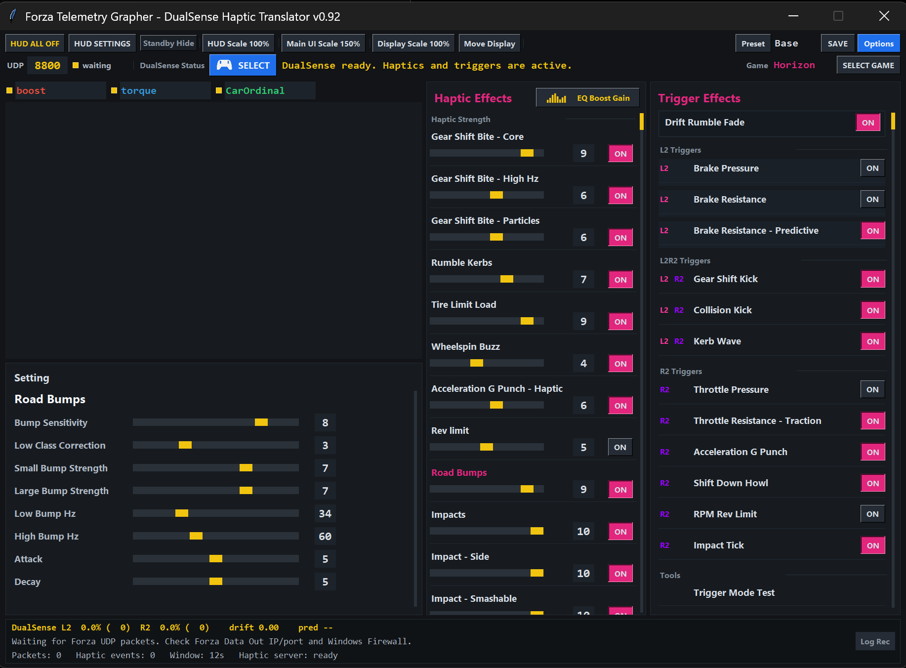

# Forza Horizon DualSense Haptic Translator

A highly experimental Forza Horizon telemetry translator for DualSense haptic audio and adaptive trigger feedback on Windows.

## Notice

**DualSense Haptic Translator** is an unofficial personal experimental project.

This project is not affiliated with, endorsed by, sponsored by, or supported by Microsoft, Xbox, Turn 10 Studios, Playground Games, Forza, Sony, PlayStation, or DualSense.

This app is **not** an Xbox controller emulator. It does not replace Steam Input, DSX, DS4Windows, reWASD, or any other input tool.

This app reads Forza Horizon UDP telemetry and translates selected vehicle state, grip, braking, slip, road feedback, impacts, and trigger feedback into DualSense haptic audio and adaptive trigger output.

This project exists for players who enjoy experimenting with DualSense feedback in Forza Horizon, which does not officially provide native DualSense haptics. It is not intended to compare against, replace, or claim superiority over other gamepads, controller tools, or force-feedback systems.

This software is provided **as-is**. Compatibility, stability, and support are not guaranteed. Use it at your own risk.

## Recommended Setup

- Steam version of Forza Horizon
- Wired DualSense controller
- Forza Data Out enabled
- `Select DualSense` completed inside this app after first launch

## Additional Setup May Be Required

The following environments may require additional configuration and may not work reliably on every PC:

- Xbox App / Microsoft Store / Game Pass versions
- Bluetooth DualSense haptic output
- DSX / DS4Windows / Steam Input / reWASD conflicts
- Windows loopback, firewall, or custom network configurations

## Current Status

This is a `v0.9.2` pre-release shared early for requested testing. It is not complete software, and correct operation is not guaranteed on every PC, controller firmware, Windows audio configuration, Forza version, or store version.

Haptic tuning, trigger behavior, HUD behavior, presets, device routing, and compatibility may still change before `v1.0`.

## App Preview

The app provides a tuning-oriented interface for telemetry graphs, haptic effect levels, adaptive trigger effects, HUD controls, presets, and DualSense device selection.



## Installation Video

Watch the setup video before installing if this is your first time using the app:

[](https://youtu.be/RCV-Fzagu7k)

[Open the installation video on YouTube](https://youtu.be/RCV-Fzagu7k)

## Quick Start For Release ZIP

For normal release users, you do not need to start the server manually. The release launcher starts the required DualSense output server automatically.

1. Connect your DualSense controller to Windows, preferably by USB.
2. Download the release ZIP and extract it.
3. Start `DualSense Haptic Translator.exe` from the extracted release folder.
4. In the app, press `Select DualSense` and choose the actual DualSense audio output device you are using. This step is required for haptic audio output.
5. In Forza Horizon, enable Data Out.
6. Set the target IP and port:
   - IP Address: `127.0.0.1`
   - Port: `8800` by default, or the port shown in the app.

If haptic output does not work, first check that the selected Windows playback device is the DualSense audio device, then use the app's haptic test button.

## Store Version Notes

Steam versions of Forza Horizon usually work with `127.0.0.1` Data Out without extra Windows setup.

Xbox App / Windows Store versions can run inside an AppContainer. In that case, Windows may block loopback traffic from the game to a local app. If Forza Data Out is enabled but this app receives no telemetry, add a loopback exemption for the Forza package.

Open PowerShell as Administrator and list current loopback exemptions:

```powershell
CheckNetIsolation LoopbackExempt -s
```

For a working Forza Horizon package, you may see an entry like:

```text
[3] -----------------------------------------------------------------
    Name: microsoft.sunrisebasegame_8wekyb3d8bbwe
```

If the Forza package is not listed, add it:

```powershell
CheckNetIsolation LoopbackExempt -a -n=Microsoft.SunriseBaseGame_8wekyb3d8bbwe
```

Then restart Forza and use these Forza Data Out settings:

```text
DATA OUT: ON
IP ADDRESS: 127.0.0.1
PORT: 8800, or the telemetry port shown in the app
```

If `127.0.0.1` still does not work, try setting the Forza Data Out IP address to this PC's IPv4 address from `ipconfig`.

### Optional DS4Windows Compatibility Workaround

For Xbox App / Windows Store users, DS4Windows can also be used as a practical compatibility workaround. In this setup, DS4Windows lets the DualSense appear to the game as an Xbox 360 controller for normal game input, while this app still handles DualSense haptic audio and adaptive trigger resistance.

This is optional and is mainly intended for users whose Store/Xbox App version of Forza behaves better with Xbox-style controller input. DS4Windows is a separate third-party tool and is not included with this project.

The telemetry listener should bind to all interfaces, not loopback only. In C#, that would look like:

```csharp
var udp = new UdpClient(new IPEndPoint(IPAddress.Any, port));
```

This app's telemetry listener is started with `--host 0.0.0.0`, which follows the same idea and keeps LAN/IP testing possible.

## What To Watch First

- `rpm_ratio`: engine intensity and pitch source.
- `speed_kmh`: road/air intensity source.
- `gear`: shift event detection.
- `accel` / `brake`: input-based intensity.
- `slip_combined_max`: wheel slip, drift, tire scrub.
- `surface_rumble_max`: kerb/gravel/road texture.
- `smashable_vel_diff`: object impact candidate.
- `accel_g`: collision and body shock candidate.

## Source / Development Note

Release ZIP users should use `DualSense Haptic Translator.exe`. The launcher starts the required server automatically.

Source runs are mainly for development and debugging. If you are working from the source tree, start with `run_telemetry_grapher.bat`.

## Support And Issues

Support is not guaranteed. Constructive bug reports and technical feedback are welcome, but issues without enough environment information may not be answerable.

Please see [SUPPORT.md](SUPPORT.md) before opening an issue.

## License

This project is distributed under a source-available non-commercial license. It is **not** an OSI-approved open source license. See [LICENSE](LICENSE).

Note: `maxGears` is intentionally not used for gear-shift haptic classification because tuned transmissions can make it stale or misleading.
