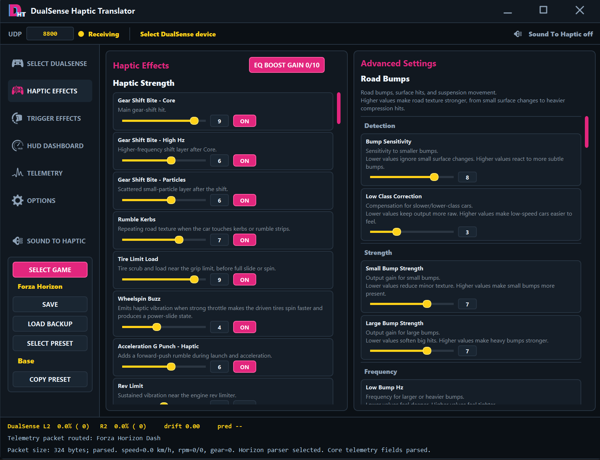
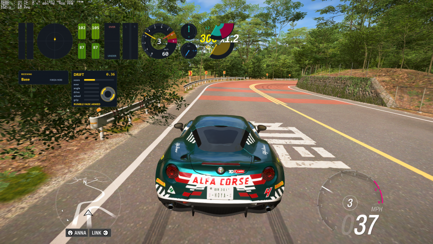

# DualSense Haptic Translator

**Version 1.11 is the latest stable patch release.**

DualSense Haptic Translator converts Forza Horizon and Forza Motorsport UDP telemetry into DualSense haptic audio, adaptive trigger feedback, and configurable HUD overlays on Windows.

[Download the latest Windows release](https://github.com/hoyachoe/DualSense-Haptic-Translator/releases/latest)

## App Preview

### Haptic Effects And Advanced Settings

### HUD Overlays In Forza Horizon

## Core Features

- Product-style PySide6 interface with separate Horizon and Motorsport profiles.
- DualSense audio-device selection, haptic output, and adaptive trigger output.
- Telemetry-driven tire, road, kerb, shift, impact, engine, slip, and traction effects.
- HUD overlays for RPM, tires, pedals, steering, G-force, drift, triggers, and the active preset.
- Three RPM styles: Classic, Modern, and a 40-segment Digital Bar.
- Per-game presets with Base, Soft, Semi-Strong, Strong, and two user slots.
- Optional DSX output, telemetry relay, preset shortcuts, and Sound To Haptic.
- English and Spanish main UI, with Korean, Chinese, and Spanish effect descriptions.

## What's New In Version 1.11

- HUD Standby Hide now recognizes the Forza Horizon garage as well as menus.
- Garage detection uses a short multi-packet confirmation and does not hide the HUD during moving handbrake use.
- Predictive Brake Resistance keeps the configured base L2 wall while the handbrake is held, suspending only slip prediction and pulse modulation until release.
- Version 1.1's independent HUD scaling and restored Haptic EQ Boost Gain behavior remain unchanged.

## Recommended Setup

- Windows 10 or Windows 11, 64-bit.
- A wired USB connection to the DualSense controller is recommended.
- Forza Horizon or Forza Motorsport with Data Out enabled.
- Extract the release ZIP before running the application.

## Quick Start

1. Connect the DualSense controller to Windows, preferably by USB.
2. Download the latest release ZIP and extract the entire folder.
3. Run `DualSense Haptic Translator.exe`.
4. On the first screen, select the DualSense audio device, run `Test Haptic`, and save the device.
5. Select the matching game profile in the app.
6. Enable Forza Data Out and set its destination to `127.0.0.1` with port `8800`.
7. If you changed the port shown at the bottom of the app, use the same port in Forza.

All HUD overlays, DSX output, Sound To Haptic, and telemetry relay begin disabled on a clean first run. Enable only the features you want to use.

## RPM HUD Styles

- **Classic**: the original circular tachometer.
- **Modern**: a layered arc with current RPM, red zone, learned upshift marker, gear, and speed.
- **Digital Bar**: a 40-segment horizontal RPM bar with gear and speed.

Digital Bar is selected as the clean first-run RPM style, but the RPM HUD itself remains off until enabled.

## Store Version Notes

Steam versions of Forza usually work with `127.0.0.1` Data Out without additional Windows configuration.

Xbox App, Microsoft Store, or Game Pass versions may require a Windows AppContainer loopback exemption. If telemetry remains disconnected after Data Out is enabled, check Windows Firewall and the loopback configuration for the installed Forza package.

## Optional Integrations

- **DSX** requires DSX to be installed and configured separately.
- **Sound To Haptic** requires a compatible Windows audio source and output setup.
- DS4Windows, Steam Input, reWASD, or other controller tools can conflict with device access or trigger output depending on their configuration.

## Upgrading From 1.1, 1.0, Or 0.9.x

Version 1.1, Version 1.0, and compatible `0.92` settings using snapshot format `1` are preserved. On the next normal save or exit, the app creates a backup and records version `1.11`. Version 1.0 HUD layout values are migrated once if needed to preserve their physical size and screen position. Older RPM settings without a style field continue to use Classic.

## Installation Video

The earlier installation video still explains the basic DualSense and Forza Data Out setup. The current PySide6 interface is newer than the interface shown in the video.

[Watch the installation video on YouTube](https://youtu.be/RCV-Fzagu7k)

## Source And Building

The release ZIP is recommended for normal users. Source and reproducible public-build instructions are in [BUILDING.md](BUILDING.md).

## Notice

This is an unofficial source-available project. It is not affiliated with, endorsed by, sponsored by, or supported by Microsoft, Xbox, Turn 10 Studios, Playground Games, Forza, Sony, PlayStation, or DualSense.

The software is provided as-is. Hardware, firmware, Windows audio, game, and third-party controller-tool configurations can affect compatibility. See [SUPPORT.md](SUPPORT.md) before opening an issue.

## License

Distributed under the project's source-available non-commercial license. This is not an OSI-approved open-source license. See [LICENSE](LICENSE).
